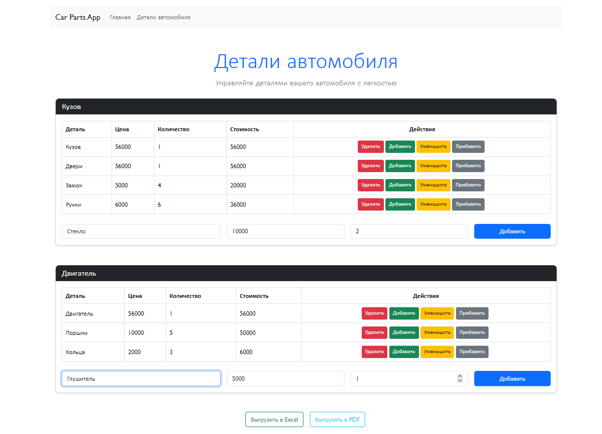
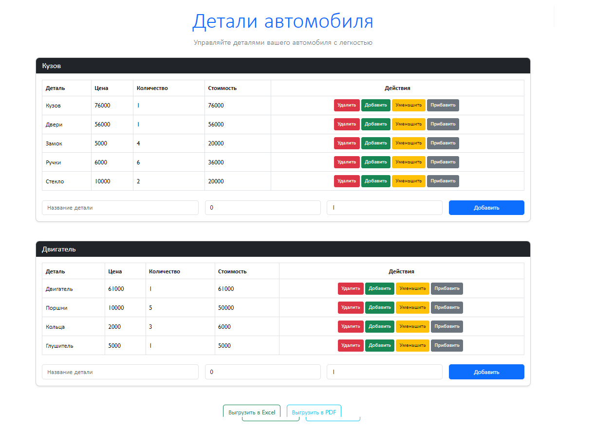
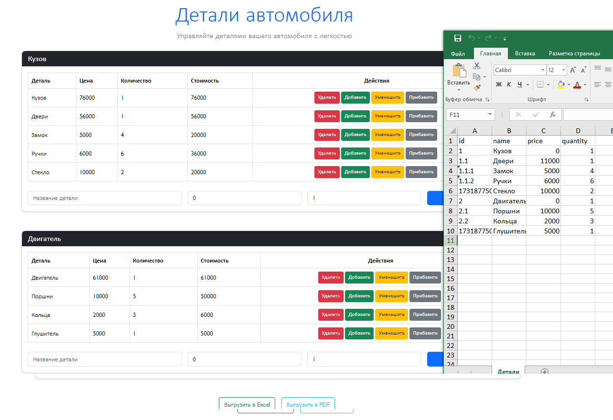
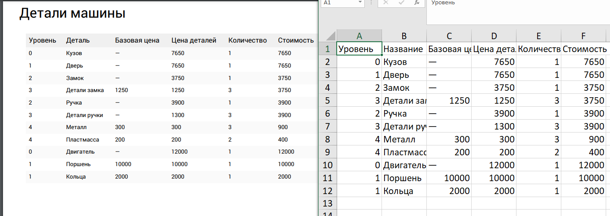

# car-parts-app
## Установка зависимостей
```
npm install
```
### Компиляция
```
npm run serve
```
### Условия
 1. Сделать Single Page Application
2. Главная страница должна содержать сведения о деталях автомобиля.
Деталь	Цена	Количество	Стоимость	Действия (кнопки)
1. Кузов	11000	1	Цена*Количество	Удалить. Добавить
1.1 Двери 	11000	3	Цена*Количество	Удалить. Добавить
1.1.1 Замок	5000	4	Цена*Количество	Удалить. Добавить
1.1.2 Ручки 	6000	6	Цена*Количество	Удалить. Добавить
… еще детали (без ограничений)				
2. Двигатель	12000	1	Цена*Количество	Удалить. Добавить
2.1 Поршни	10000	5	Цена*Количество	Удалить. Добавить
2.2 Кольца 	2000	3	Цена*Количество	Удалить. Добавить
… еще детали (без ограничений)				
 Все элементы имеющие дочерние должны быть расчетными. Например: Дверь состоит из Замков (5000) и Ручек(6000) поэтому его цена равна 11000 (5000+6000).
Также может расширятся детализация, можно добавить к Двери еще Стекло, тогда цена Двери вырастет. А так как в состав Кузова входит Дверь, вырастет и цена Кузова. 
3. Должна быть возможность выгрузить всю таблицу в Excel или PDF
4. Рабочий проект выложить на GitHub и прислать ссылку.
5. Быть готовым пояснить что и как написано в коде.
6. Предпочтительно сделать на VueJS, BootstrapVue, TypeScript 
### Ответы
1. Значения в таблице можно изменять через интерфейс CRUD, обеспечивающий функции создания, чтения, обновления и удаления данных.
2. Дочерние элементы можно добавлять, при этом их уровень автоматически увеличивается. Базовая цена родительского элемента формируется как сумма от значений всех его дочерних элементов. При создании нового дочернего элемента родительский элемент автоматически получает значение 0.
3. Дочерние элементы изначально имеют собственные базовые значения, однако при добавлении к ним новых дочерних элементов (на более низких уровнях) они теряют свои базовые значения, так как их значение пересчитывается на основе сумм дочерних элементов.
4. Функционал позволяет экспортировать текущие данные таблицы в формате PDF и Excel для дальнейшего использования и анализа.

### Результаты




