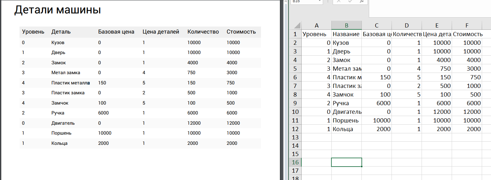
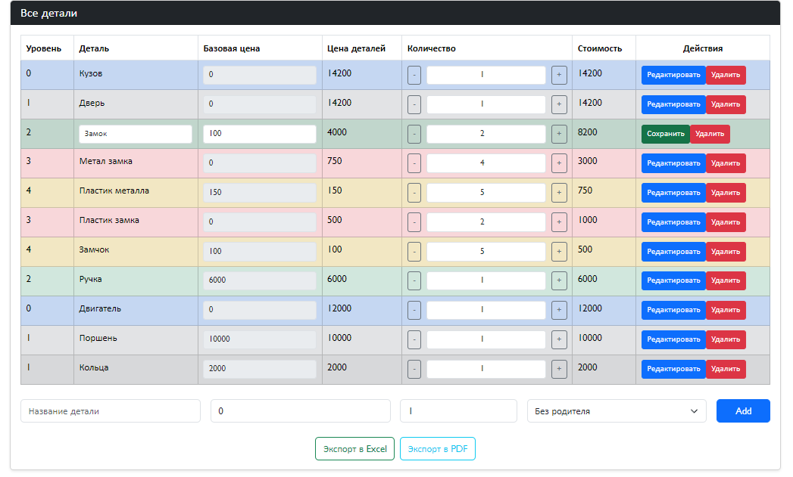
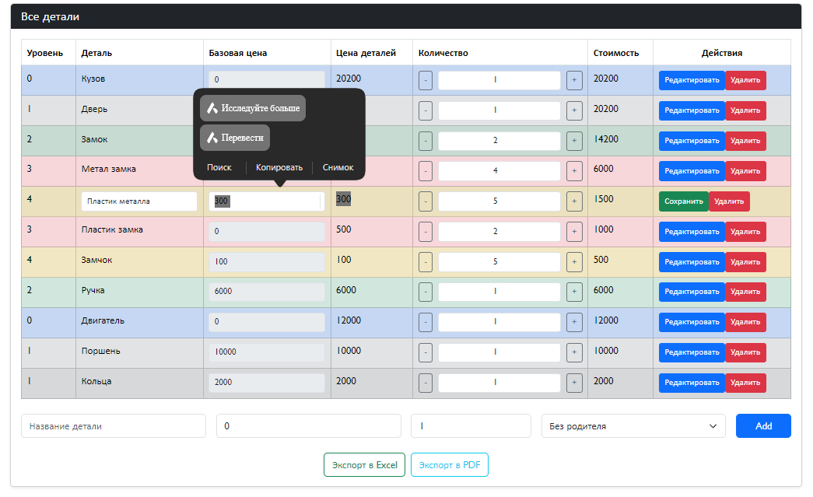

# car-parts-app

## Установка зависимостей
```
npm install
```

### Компиляция
```
npm run serve
```

### Условия
 1. Сделать Single Page Application
2. Главная страница должна содержать сведения о деталях автомобиля.

Деталь	Цена	Количество	Стоимость	Действия (кнопки)
1. Кузов	11000	1	Цена*Количество	Удалить. Добавить
1.1 Двери 	11000	3	Цена*Количество	Удалить. Добавить
1.1.1 Замок	5000	4	Цена*Количество	Удалить. Добавить
1.1.2 Ручки 	6000	6	Цена*Количество	Удалить. Добавить
… еще детали (без ограничений)				
2. Двигатель	12000	1	Цена*Количество	Удалить. Добавить
2.1 Поршни	10000	5	Цена*Количество	Удалить. Добавить
2.2 Кольца 	2000	3	Цена*Количество	Удалить. Добавить
… еще детали (без ограничений)				
 Все элементы имеющие дочерние должны быть расчетными. Например: Дверь состоит из Замков (5000) и Ручек(6000) поэтому его цена равна 11000 (5000+6000).
Также может расширятся детализация, можно добавить к Двери еще Стекло, тогда цена Двери вырастет. А так как в состав Кузова входит Дверь, вырастет и цена Кузова. 

3. Должна быть возможность выгрузить всю таблицу в Excel или PDF
4. Рабочий проект выложить на GitHub и прислать ссылку.
5. Быть готовым пояснить что и как написано в коде.
6. Предпочтительно сделать на VueJS, BootstrapVue, TypeScript 

### Ответы
1. Значения можно изменять через CRUD.
2. Дочерние элементы можно добавлять, при этом уровень элемента увеличивается. Базовая цена формируется суммированием значений дочерних элементов. Как только создаётся дочерний элемент, его родитель автоматически принимает значение unknown.
3. Верхний ползунок убирает столбец "Базовая цена", однако значение базовой цены всегда остаётся исходным. Изначально дочерние элементы имеют собственные значения, но после добавления к ним новых дочерних элементов (ниже по уровню) они теряют базовые значения, поскольку их значение формируется на основе дочерних элементов нижнего уровня.
4. Вывод ниже на PDF и EXCEL
 
### Рекомендаций
1. Разделение кода на маленкие куски например расчеты в utils/part(calculate)
2. Декомпозиция компонентов в components/partstable:newparte
3. Можно исползоват мемоизация (устранения повторных вызовов методов путем кэширований) в моем случае calculatetotal и calculatedetailprice
4. Улучшение UI/UX интерфейса
5. Улучшение PDF и EXCEL можно добавлять логотипы и отчеты ,генераций ,дополнительные информаций об PDF
6. Можно интегрировать с другими API
7. Можно написать тесты на JEST, Vue Test Utils 

### Результаты




